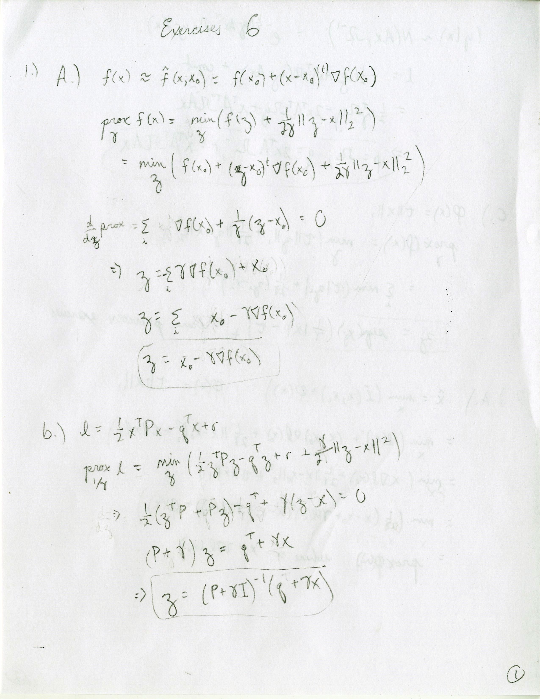
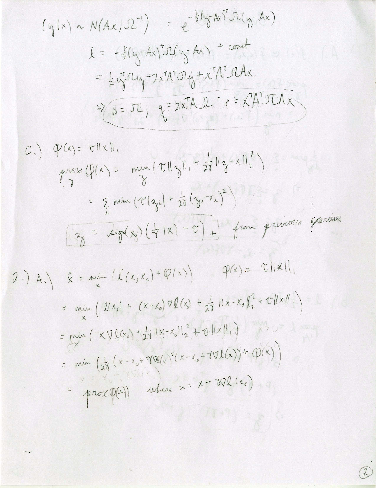
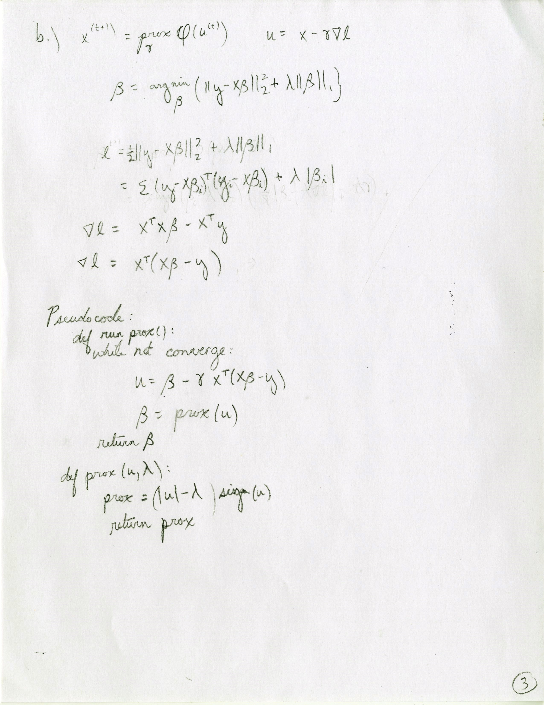

# Week 6 Exercises

## The Proximal Operator

 
 
 

## Proximal Gradient Descent

The code for this part can be found [here](proximal.py)

The coefficients that result using proximal gradient are shown on the left, and the result of using scikit-learns built in lasso is shown on the right:

  

The two show similar behavior.

## Momentum

  

This plot shows the algorithm converging far more quickly when momentum is added.
