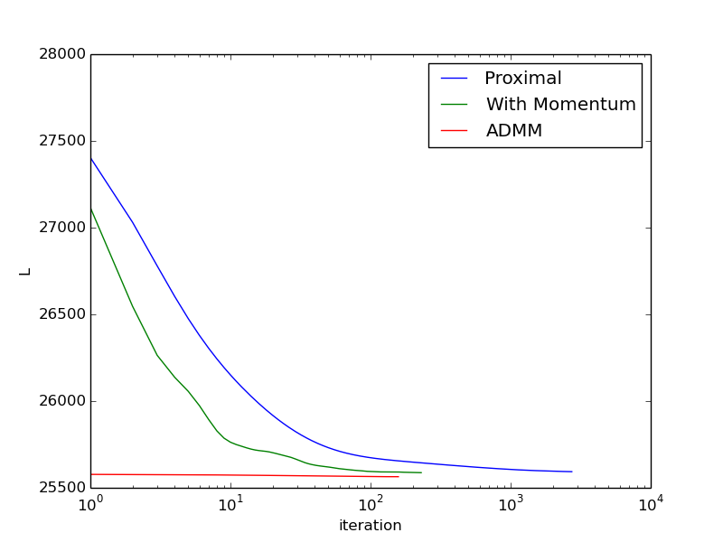

# Week 7 Exercises

## ADMM

The code for this part can be found [here](admm.py)

The relevant part for running ADMM:
```python 
    x_inv = np.dot( X.T, X ) + rho * np.identity( X.shape[1] )
    xy = np.dot(X.T, y[:,0])

    while not test_converge(err, 10e-8):
        print calc_mse(np.dot(X, b), y[:,0])+alpha*sum(abs(z))
        b = np.linalg.solve(x_inv, xy + rho* (z - u ))
        z = calc_prox( b + u , alpha/rho)
        u = u + b - z
        err.append(calc_mse(np.dot(X, b), y[:,0])+alpha*sum(abs(z)))
    return b, err
```
Here are the results:

  

This plot shows the admm algorithm converging far more quickly than the proximal gradient method.
